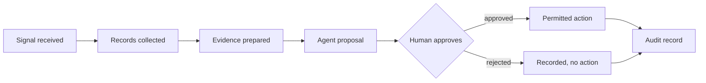

# Agentic Approval Gates

A reference for putting AI agents into processes that have to survive an audit.

Most agentic AI writing is about capability — what an agent can do on its own. This is
about the opposite question, which is the one regulated organisations actually ask:
**who approved it, on what evidence, and can you produce the record afterwards.**

---

## Where this comes from

I spent three years building MEPS+ before it went live in 2006, and kept returning to it
for years afterwards. It is Singapore's real-time gross settlement system, through which the
country's banks settle with one another. In a settlement system nothing moves without an
authorisation trail. Not "usually". Not "for large amounts". Nothing.

That constraint teaches you something that transfers directly to agents: the useful
question about automation is not whether it *can* act, but whether someone approved it and
whether you can prove it afterwards.

Singapore's IMDA has since published a *Model AI Governance Framework for Agentic AI*.
Under its second dimension, making humans meaningfully accountable, it recommends

> defining significant checkpoints in the agentic workflow that require human approval,
> such as high-stakes or irreversible actions, and regularly auditing human oversight to
> check that it remains effective over time.

When it reaches for an example of an action that must stop and ask a person, it picks
"making a payment above a predefined amount." That is an authorisation limit — the most
ordinary control in a settlement system, arriving as the canonical illustration of when a
machine should stop.

This document is one answer to what that looks like in an actual architecture.

---

## The sequence

Seven steps. The evidence changes by domain; the gate does not.

| # | Step | What it produces | Why it exists |
|---|---|---|---|
| 1 | **Signal received** | A timestamped trigger with its source | You must be able to say what started this |
| 2 | **Records collected** | The source documents, with provenance | Retrieval is not evidence until you know where it came from |
| 3 | **Evidence prepared** | A bounded, citable evidence set | The approver reads this, not the raw corpus |
| 4 | **Agent proposal** | A specific proposed action plus its reasoning | A proposal, never an action |
| 5 | **Human approves** | An identity, a timestamp, a decision | The gate. Both outcomes are recorded |
| 6 | **Permitted action** | Execution inside a declared permission boundary | The agent can only do what the approval authorised |
| 7 | **Audit record** | The whole chain, immutable | Reconstructable months later by someone who wasn't there |

---

## Why the fully autonomous variant fails an audit

The tempting simplification is to remove step 5 once the agent is "reliable enough". Three
things break.

**Automation bias.** The more reliable the system, the less carefully humans review it. A
gate that exists but is rubber-stamped is worse than no gate, because it manufactures a
record of approval that carries no judgement. This is measurable, and the framework says
how: watch the human override rate, since a low one "may signal rubber-stamping
behaviours", and watch review times, since a short one may signal automation bias. Gates
have to be designed so the approver sees something they can actually evaluate — which is
why step 3 exists separately from step 2.

**Unbounded blast radius.** Without step 6's permission boundary, "approve this action"
silently becomes "approve this agent". The approval must be scoped to the action, not the
actor. The framework's own case material shows the shape of this: approval to edit files
valid only for the session it was given in, while a shell command can be approved for a
project. The permission is fitted to the action rather than to the person.

**Decisions that cannot be reproduced.** If the evidence set is not captured at step 3, you
can re-run the agent later and get a different answer, because the underlying records
moved. An audit trail that cannot be reproduced is a log, not a record.

Reproducibility is worth separating from explanation, because they are different
properties and the difference is easy to lose. A model can produce a fluent account of its
own reasoning and that account can be a post-hoc narrative. The framework notes the same
thing: chain-of-thought reasoning "is not analogous to human reasoning and may not be a
faithful explanation of the agent's actions."

---

## Design rules

- **Agents read the record; they do not rewrite it.** Durable writes require explicit
  authority, separate from the agent's read path.
- **Proposals are typed, not prose.** An approver should not have to parse free text to
  know what will happen.
- **Both outcomes are recorded.** Rejections are evidence too — often the most useful kind.
- **The permission boundary is declared before the proposal, not after the approval.**
- **Retrieval is bounded and cited.** An evidence set with no provenance cannot be audited.
- **Prefer a deterministic control to an instructed one.** A guardrail written into a
  prompt is a request. If it matters, it belongs in the layer that executes.
- **Roll out progressively**, with the gate in place from the first percent.

---

## Where the gate sits, by domain

Illustrative only. These are not engagements; they are four places the same shape shows up.

| Domain | Signal | The decision a human owns |
|---|---|---|
| Hiring | Application received | Whether a candidate advances |
| Agriculture | Sensor or inspection reading | Whether an intervention is applied |
| Energy | Demand or fault signal | Whether load is redirected |
| Pharmaceuticals | Batch or deviation record | Whether a batch proceeds |

The pattern is constant. What changes is what the evidence looks like and who is competent
to approve it.

---

## What this is not

Not a framework, a library, or a product. It is a written description of a pattern,
offered because most of the agentic-AI conversation is about autonomy and very little of
it is about the guardrails that let a regulated business actually put agents into
production instead of piloting them forever. There is no package to install, no API, no
versioned release, and nothing here is a dependency you should point a build at.

The memory half of the same system is in
[ai-memory-reference](https://github.com/raghuvinta/ai-memory-reference).

## Source

IMDA, *Model AI Governance Framework for Agentic AI*, version 1.5, published 20 May 2026
and updated 5 June 2026. Version 1.0 launched 22 January 2026. All quotations are from
version 1.5.
[Framework (PDF)](https://www.imda.gov.sg/-/media/imda/files/about/emerging-tech-and-research/artificial-intelligence/mgf-for-agentic-ai.pdf)

## Contributing

Issues that argue with the pattern are welcome. Pull requests are generally not — the
document records how one person did a thing and why, so a merged change from someone else
would make the provenance untrue. If you have a better way, write it up and link it; I will
link back.

## Licence

Prose and diagrams: [CC BY 4.0](https://creativecommons.org/licenses/by/4.0/). Any code
snippet: MIT. Attribution to Raghu Vintha, with a link to the source repository.

---

*Raghu Vintha — CTO, SMAARiX. Singapore. [raghuvintha.com](https://raghuvintha.com)*
